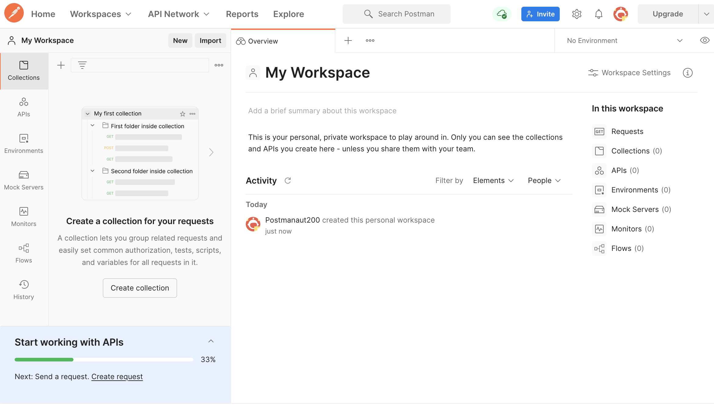

# Getting Started with Postman

## Accessing Postman
Postman can be accessed via the web browser or desktop application.

## Steps to Get Started:

1. Navigate to [Postman's website](https://www.postman.com/)
2. Sign in with your account credentials or sign up for free if you don't have an account.
3. Install Postman Agent, a micro-app that helps overcome browser limitations for API calls.

## Post-login Experience:
- If you create a new account, you'll be directed to the default workspace named "My Workspace."

- For existing account holders, logging in will take you to the Home dashboard, which includes a greeting message and various links.

