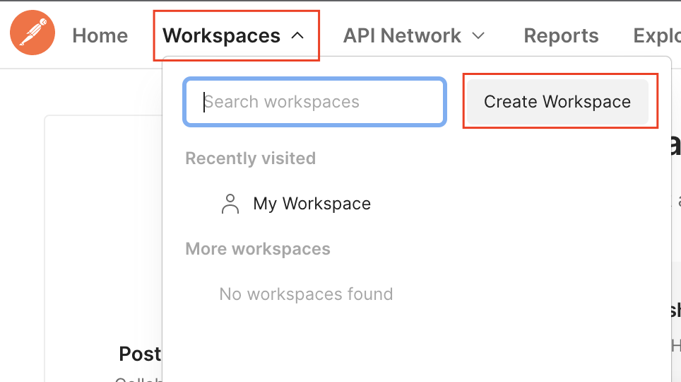
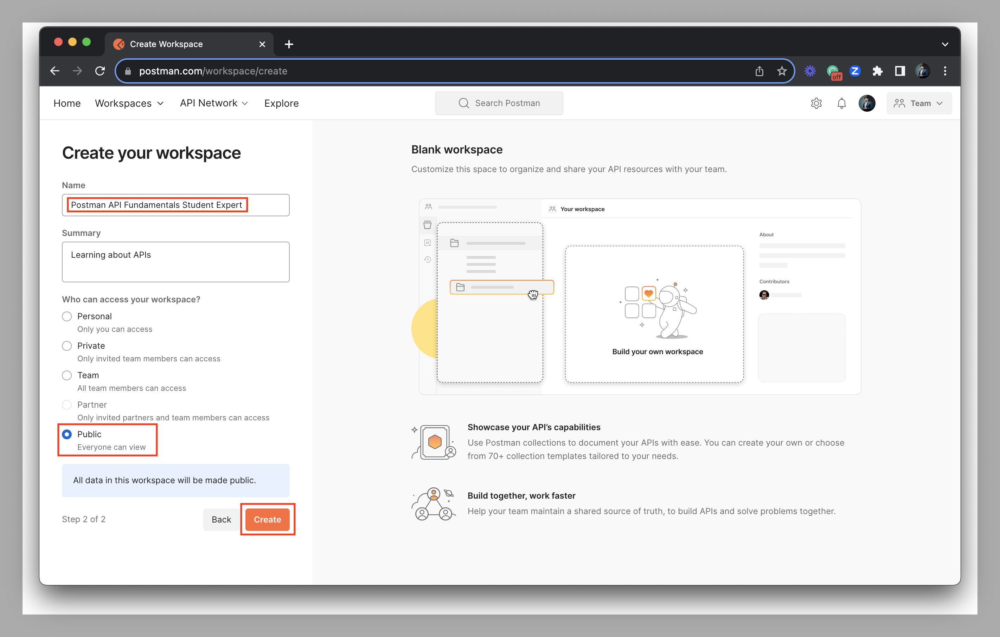
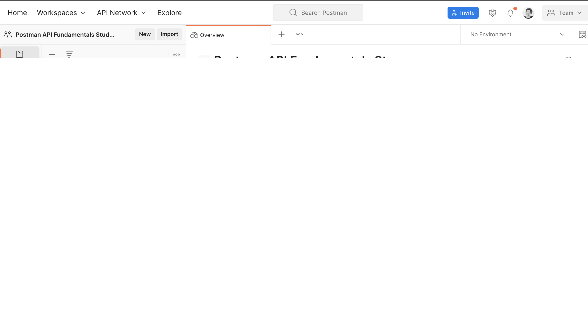

# Task: Create a workspace using Postman Library API v2

## Overview:
- The Postman Library API v2 enables CRUD operations (Create, Read, Update, Delete) on books in a public library database.
- To interact with this API and manage books, you need to use Postman.

## Steps to Create a Workspace:
1. **Access Workspaces Dropdown**: 
- Click on the Workspaces dropdown menu.

2. **Create Workspace**:
- Choose "Create Workspace" from the dropdown.

3. **Select Blank Workspace Template**:
- Opt for the "Blank Workspace" template.

4. **Name Your Workspace**:
- Set the name as "Postman API Fundamentals Student Expert".
- Choose visibility as Public (or Personal if Public workspace creation isn't available in your team settings).
- Click "Create Workspace".

5. **Success Message**:
- Upon successful creation, you'll see a message welcoming you to the empty workspace.

