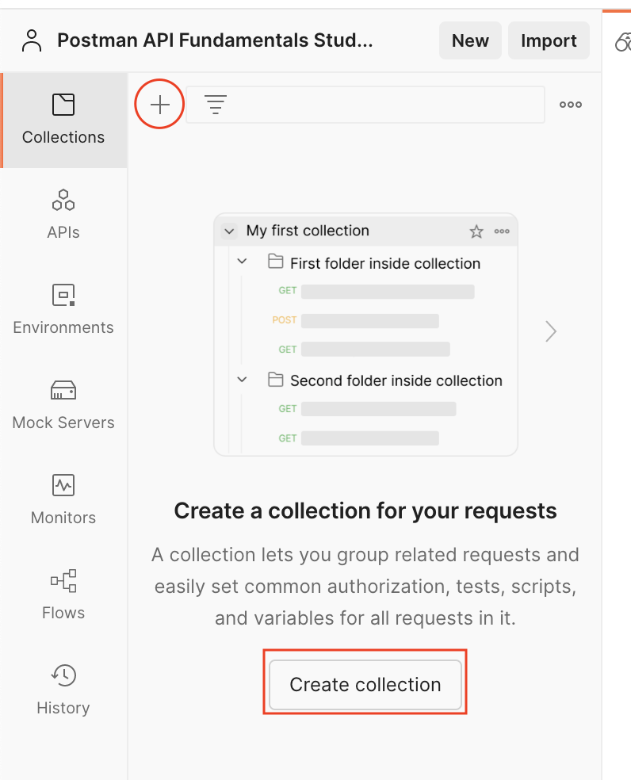

# Task: Create a Collection

Collections are used in Postman to organize API requests.

1. **Create a New Collection:**
   - Open Postman and navigate to the left pane.
   - Click the plus ("+") icon or select "Create a collection."

2. **Name Your Collection:**
   - Upon creation, provide a name for your new collection.
   - Name it "Postman Library API v2."

