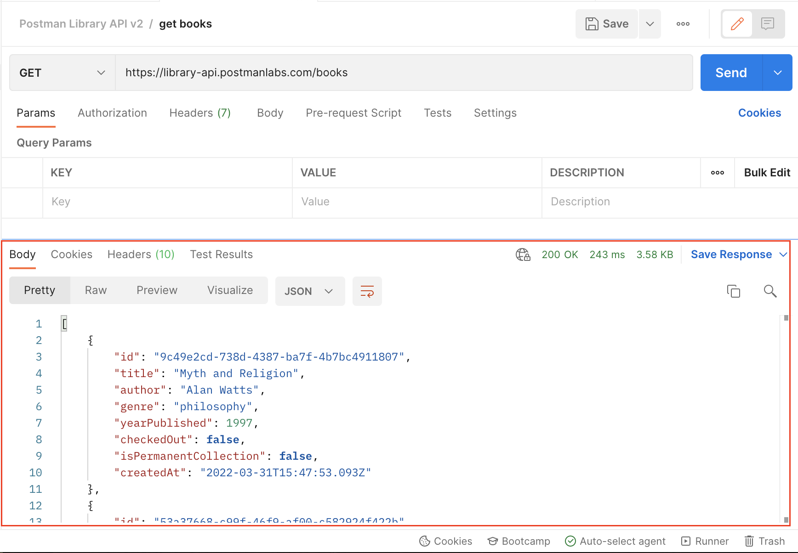

# Task: Get books from the Library API

## Making the First Request
1. Create a new request within your Collection by clicking "Add a request" or via the three dots icon.

2. Name the request "get books", set the request method to GET, and the request URL to `https://library-api.postmanlabs.com/books`.

3. Send the request by clicking the "Send" button.

## Viewing the Response
Once the request is sent, the server will respond with a JSON(JavaScript Object Notation) body containing an array of book objects.

## Request Methods
HTTP request methods, also known as HTTP verbs, dictate the type of operation to perform.
  
| Method name | Operation |
|-------------|-----------|
| GET         | Retrieve data (Read) |
| POST        | Send data (Create) |
| PUT/PATCH   | Update data (Update) |
| DELETE      | Delete data (Delete) |

The choice of method depends on the intended operation and API documentation.

## Request URL
A request URL consists of a protocol, host, and path, pointing to a specific resource on the server.
  - Protocol: `https://`
  - Host: `library-api.postmanlabs.com`
  - Path: `/books`

## Response Status Codes
Response status codes indicate the success or failure of a request.
  
| Code range | Meaning |
|------------|---------|
| 2xx        | Success |
| 3xx        | Redirection |
| 4xx        | Client error |
| 5xx        | Server error |

Each code has its significance, e.g., 200 means "OK", 404 means "Not Found".

