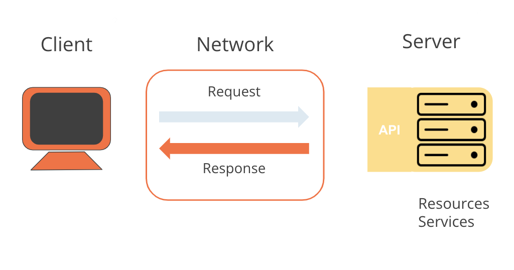

# Request-Response Pattern

## Overview
- Represents how computers communicate over a network.
- API serves as the interface indicating the expected response for specific calls to a server.

## Process
1. **Client Makes Request:**
  - Agent initiating the request, could be a browser or a custom-coded application.
  - Example: Postman acts as the client in sending requests.

2. **Request Sent to Server:**
  - Request is transmitted over the network to a designated server.
  - Example: Making a request over the public internet to a server like `https://library-api.postmanlabs.com`.

3. **Server Processes Request:**
  - Server interprets the request (e.g., HTTP GET /books) received from the client.
  - Example: The server understands the request and proceeds to process it.

4. **Server Sends Response:**
  - After processing, the server sends back an appropriate response over the network.
  - Example: Postman client receives a response from the server, such as a list of books.

## Example Scenario
- HTTP GET request made to `https://library-api.postmanlabs.com/books`.
- Server responds with a list of books.

## Conclusion
- Request-response pattern facilitates communication between clients and servers over a network.
- Understanding this pattern is crucial for designing and developing applications that interact with backend services.
